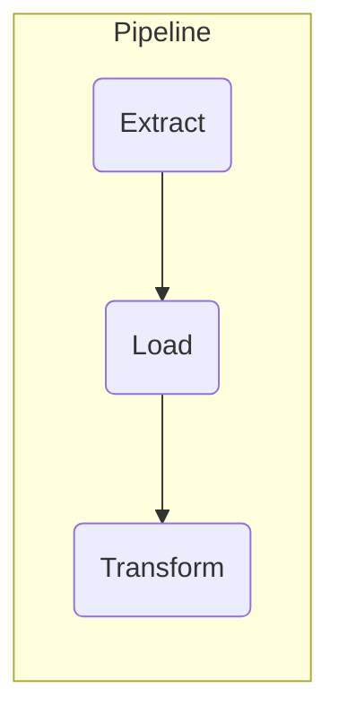

# Welcome to MkDocs

For full documentation visit [mkdocs.org](https://www.mkdocs.org).

## Workflow

# Função de extração de dados

### ::: app.pipeline.extract.extract_from_excel

# Função de transformação de dados

### ::: app.pipeline.transforme.concat_data_frames

# Função de carga de dados

### ::: app.pipeline.load.load_excel

## Project layout

    mkdocs.yml    # The configuration file.
    docs/
        index.md  # The documentation homepage.
        ...       # Other markdown pages, images and other files.
